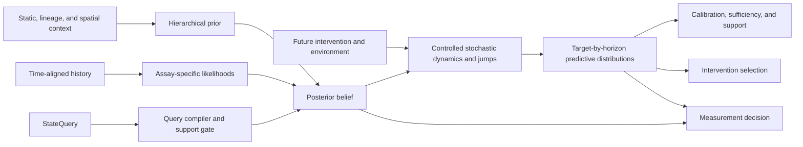

# cellstate

`cellstate` is a Python package being built to compute a faithful representation of hidden cellular
state, and to prove a representation faithful before anything is allowed to depend on it.

Given everything observed about a cell, clone, population, or tissue niche up to time `t`, the system
returns a probability distribution over the state that cell system must be in — and returns it only
when the evidence supports one. The state is not a label, an embedding, or a coordinate on a learned
manifold. It is whatever must be believed about the system in order to predict its future molecular
and functional behavior under a declared intervention. "Faithful" has an exact meaning, given below.

The contracts and the definition of faithfulness exist today. No biological backend does. What
follows is the design and the tests it must pass, not a description of working software.

## The problem

The field can measure cells at enormous scale and cannot yet say what state a cell is in.

Cell-type labels describe a population, not a system. Embeddings reconstruct the assay that produced
them. Perturbation-response models are commonly trained and scored on cells drawn at random from the
same wells, so a random cell-level split reports memorization as generalization. Whether such models
beat a condition mean on held-out experimental units is exactly the measurement this repository
intends to make; it is not asserted here. What is clear is that none of these objects is validated
against the thing that would make it a state: the ability to predict what happens next under an
intervention that was not in the training set.

The gap is not primarily one of scale. It is that no widely used representation declares what it
claims to support, and none is tested for whether it is sufficient for the prediction it is used to
make.

## The object

For a query `Q`, the target is

```text
B_t^Q = P(X_t^Q, Theta, R_{<=t}, Xi | H_{<=t}, C, Q)
```

where

- `X_t^Q` is the query-relevant dynamic state;
- `Theta` contains stable or slowly varying subject, donor, genotype, and lineage parameters;
- `R_{<=t}` is realized perturbation or target engagement, distinct from intended assignment;
- `Xi` contains assay, batch, capture, segmentation, and other measurement nuisance variables;
- `H_{<=t}` is the causally ordered evidence history;
- `C` is declared population, lineage, spatial, and environmental context.

The belief is useful only insofar as it predicts declared future targets:

```text
P(Z_{t+h} | B_t^Q, do(U_{t:t+h}), E_{t:t+h}, Q)
```

where `Z` contains query targets rather than backend-private latent coordinates. The use of `do(U)`
in notation is not itself a causal guarantee: every output carries an explicit evidential status —
predictive association, identified population intervention effect, transported effect under
enumerated assumptions, mechanistic extrapolation, or unsupported.

Concretely, for a fourteen-day differentiation query on a perturbed culture, `X_t^Q` holds the slow
lineage-commitment and proliferative factors that determine day-14 composition; `Theta` holds the
line's genotype and the donor; `R_{<=t}` holds which cells actually received and responded to the
edit rather than which wells were assigned it; `Xi` holds library depth and capture; and `C` holds
the culture environment. A ten-minute signaling query on the same cells would compile a different
`X_t^Q` entirely.

**State is compiled from the query.** There is no universal state representation. The state required
to predict survival after a ten-minute signaling perturbation is not the state required to predict
differentiation over two weeks. Dimensionality and factor content are derived from the query's
system boundary, targets, intervention and environment spaces, horizons, and precision requirements.
The resulting specification is fingerprinted and travels with every belief and forecast, so a
downstream consumer cannot read a number without reading the support it was computed under.

## What makes a representation faithful

Two tests, each returning a numeric verdict with a sampling distribution.

**Predictive sufficiency.** Fit two equally capable predictors of a held-out future target — one
given the belief alone, one given the belief plus the raw history — and compare a predeclared proper
score:

```text
M1: Z_{t+h} = f(B_t^Q, U, E, Q)
M2: Z_{t+h} = f(B_t^Q, H_{<=t}, U, E, Q)
gain = score(M1) - score(M2)
```

`score` is negatively oriented — a loss such as CRPS, lower is better — so `gain >= 0`. The belief is
sufficient for `Q` when the upper end of the interval on `gain` falls below the declared tolerance. If
raw history materially improves prediction, the belief is not sufficient: either the state is
incomplete or the query is too broad. The comparison is bootstrapped at the declared independent
experimental unit. A gain reported without an interval is not a verdict.

**Calibration.** Nominal predictive intervals attain nominal coverage on held-out units, reported as
an absolute coverage error with an upper confidence bound.

Cluster coherence, reconstruction error, and attractive low-dimensional projections are not
substitutes for either test.

## Principles

1. **Beliefs, not points.** Return distributions, uncertainty, identifiability, support status, and
   provenance — never a deterministic latent vector alone.
2. **Function and intervention first.** Optimize prediction of future behavior under relevant
   interventions, not reconstruction of the present assay.
3. **Time and causality are explicit.** Observations, environments, interventions, washouts,
   divisions, and contacts are ordered evidence, not an unordered feature bag.
4. **Intention is not realization.** Assignment, exposure, delivery efficiency, and measured target
   engagement remain distinct variables.
5. **Missing is not zero.** Unknown history, unmeasured modalities, censored measurements, and
   confirmed absence have different semantics.
6. **Timescales and events remain structured.** Continuous dynamics coexist with division, death,
   differentiation, and other jumps.
7. **Context is modeled.** Donor, genotype, environment, neighborhood, lineage, assay, and batch are
   inferred, not regressed away.
8. **Support is earned.** A backend may claim only the species, systems, interventions, doses,
   environments, horizons, and outputs covered by its validation evidence, and abstains elsewhere.
9. **Planning follows calibration.** Intervention and assay selection operate on calibrated
   query-target predictive distributions, never on private latent coordinates.
10. **Evidence is public and real.** Biological training, calibration, and validation claims trace to
    real public experiments with accession, version, license, and checksum. Synthetic data tests
    software.

## Design

### Four operations

Estimating a state, forecasting it, acting on it, and deciding what to measure next are different
scientific contracts, so they are different operations.

```python
belief = estimate_cell_state(request, estimator=model)
forecast = evolve_cell_state(belief, scenario=scenario, evolution_model=model)
plan = choose_intervention(belief, objective=objective, candidates=candidates, planner=planner)
measurement = recommend_next_measurement(belief, request=measurement_request, policy=policy)
```

Each validates its inputs, fingerprints the operation's capability scope against the compiled state
specification — estimation compiles that specification, the other three inherit it — runs a support
preflight, calls the backend, and revalidates the returned object against its contract. A belief and a forecast
are returned even when the readiness report requires abstention, so callers inspect structured
reasons rather than receiving a silent fallback.

Measurement selection is a decision problem, not a field computed opportunistically during
estimation. Its request binds an intervention objective, an ordered candidate set, candidate assays,
timing, a decision deadline, utility units, and assay, delay, and collection penalties. A numeric
expected value of sample information requires a calibrated assay-outcome model, a hypothetical
posterior update, counterfactual replanning, and a declared utility. Posterior covariance reduction
is not EVSI.

### Subjects

Most single-cell assays destroy the cell they measure. A time course of different cells supports
population-distribution dynamics; it is not an observed individual trajectory. Beliefs are therefore
typed by subject, and the available evidence determines which subject may be claimed:

- **population** — a hidden state shared by cells in a well, library, or arm;
- **clone or lineage** — supported where barcodes or tracked divisions were observed;
- **individual cell** — supported where the same cell was measured more than once
  nondestructively;
- **spatial niche** — supported where coordinates, contacts, or neighborhoods were measured.

A population state is a complete instance of the object: it is hidden, inferred from evidence,
evolves under intervention, and is subject to both faithfulness tests.

### A family of backends

Different evidence supports different beliefs, so the system is designed as a family of support-bounded models
sharing one set of contracts and one evaluation apparatus: a population-perturbation backend for
randomized genetic, chemical, and cytokine screens; a longitudinal-cell backend for repeated
nondestructive measurement; a lineage and fate backend for clone-linked early state and later fate;
a multimodal backend for genuinely paired assays; and a spatial backend where neighborhoods were
measured. They do not claim a shared universal latent biology until predictive equivalence is
demonstrated.

### Architecture



The specified production model is a hierarchical controlled state-space model: assay-appropriate likelihoods
for each modality; stable parameters plus fast, intermediate, and slow dynamic factors; shared and
modality-private state; stochastic continuous evolution with event and inheritance kernels; offline
smoothing for learning and past-only filtering for deployment; particle or mixture posteriors around
branches; mechanistic constraints as auditable soft priors; explicit measurement, biological,
parameter, model, and transport uncertainty; and calibrated decoders that abstain outside empirical
support.

Framework boundaries are backend-neutral. Array libraries, storage formats, and experiment trackers
enter through adapters and do not appear in serialized public contracts.

## Evidence

No single public dataset contains, at useful scale, a complete intervention and environment history,
multimodal state, same-cell temporal linkage, lineage, spatial context, and later function. Evidence
is therefore assembled as a portfolio, and eligibility is claim-specific: a dataset may train an
observation model without being eligible for causal, temporal, lineage, same-cell, spatial, or
functional validation.

Eligibility is a property of the tuple *(exact data slice, exact claim, exact loss, exact split unit,
exact use policy)* — not of a dataset name. Admission requires that a source carry a content-addressed
record of accession, version, checksums, retrieval, license and use restrictions, experimental units,
controls, assays, intervention timing, replicates, outcomes, linkage structure, and known
confounding. A split manifest makes benchmark membership reproducible, and each
benchmark's scoring transform is content-addressed so normalization is reproducible. Public availability is not permission for every use.

A dataset can carry a state estimand only if it provides an admissible observation in the target
modality before the inference cutoff **on a unit that is also observed after it**, at least two
horizons after the cutoff, an identified intervention with matched controls, and enough independent
experimental units to bootstrap. A single-timepoint destructive screen does
not: with an empty pre-cutoff history the sufficiency test is inapplicable, because there is no
hidden state to infer and no history for it to be sufficient against.

Raw data are immutable. Normalized data preserve original identifiers, counts, missingness, and
source-row provenance. Studies are joined only through observed overlap or declared transport
assumptions, never through fabricated same-cell pairs.

## Validation

Cells from a shared well, library, donor, animal, clone, or plate are pseudoreplicates. Random
cell-level splits are prohibited for scientific claims. A benchmark is admitted only if it holds out
wells, plates, libraries, donors, animals, clones, cell lines, and complete studies, and covers
future-time and held-out-dose prediction, unseen perturbations and mechanisms, missing-modality and assay shift,
deliberate out-of-support systems, and external replication with no test-time refitting.

Evaluation is specified over proper predictive scores, intervention-effect error, population
distances, hazard and fate scores, coverage, risk-coverage curves, predictive sufficiency, and planner regret. Marginal
error and all-gene correlation are maximized by predicting no change and never stand alone; a
differential-expression-weighted and a rank-based metric accompany them. Every backend must beat
persistence, matched control, condition mean, nearest condition, pseudobulk GLM, and simple
hierarchical, low-rank, and temporal state-space baselines appropriate to its query, each
individually. The best of them is the observational floor. The mandatory set is ledger entry `S9`
in [`docs/roadmap.md`](docs/roadmap.md); that list, not this sentence, is authoritative.

A backend graduates per query and per version, in this order. Each rung is a state-capability
ledger entry in [`docs/roadmap.md`](docs/roadmap.md), which is the sole authority for what is built
when and for whether a rung is satisfied; the repository phases are a separate ordering:

- contract and provenance correctness;
- deterministic ingestion and leakage-safe splits;
- calibrated assay likelihoods;
- future and intervention prediction beyond the baselines;
- calibrated uncertainty and effective out-of-support abstention;
- state-versus-state-plus-history sufficiency;
- replication on an untouched external study;
- and only then, pseudo-prospective intervention or assay planning.

A sufficiency test that fails, reported with its interval, is a result. Suppressing it is not.

## Status

**A belief is emitted from real cells, and the state-capability ledger stands at 0 of 10.** Both
halves of that sentence are the status.

The `gse274113` backend fits an RNA observation model on CRISPRi-perturbed human CD34+ haematopoietic
progenitors — 308 arms across 14 libraries, 137,604 cells, a 100-gene panel declared a priori — and
`estimate_arm("rep1", "GATA1")` returns a typed `CellStateBelief` from a bare checkout in under a
second. The fitted biology axes are recognisable haematopoietic lineage contrasts. See
[the guide](docs/guides/estimate-a-real-cell-state.md).

The capabilities that backend was scheduled to advance were measured on held-out libraries, with
intervals grouped at the library, and **every one came out negative** — S5 at 10.36 against a bound
of 0.35, S2 at 0.84 against a requirement above 1, and the S4 placebo and perturbed bands
overlapping. Those are results rather than defects, and they are largely verdicts on the deposit
before they are verdicts on the model: mean on-target knockdown across the 19 targets is **−0.043**
log₂ fold-change, so the capability tests divide by a perturbation signal that is not there. The
same panel and pipeline resolve day 7 → day 14 differentiation at **7.97×** the placebo contrast.

No benchmark has passed performance admission, no metric in any frozen suite has an executable
implementation, and the sufficiency and calibration functions still have no non-test caller. The
linear-Gaussian reference remains a contract exercise and deliberately rejects biology it does not
implement; its outputs are examples of contract behavior, not estimates of cellular state.

[`docs/roadmap.md`](docs/roadmap.md) is the authority for implementation order and graduation status.

## Quick start

Python 3.11 or newer with [`uv`](https://docs.astral.sh/uv/):

```bash
uv sync --all-extras --no-editable
uv run python examples/estimate_real_cell_state.py   # real CD34+ cells, no download
uv run --no-editable python examples/estimate_state.py   # contract reference, synthetic
uv run --no-editable pytest
```

The first example is the one to read: it estimates the state of real human progenitors and prints
each biology axis by the panel genes that define it.

```python
from cellstate.backends.gse274113 import estimate_arm, describe_state, compare_arms

print(describe_state(estimate_arm("rep1", "GATA1")))
print(compare_arms("rep1", "NT", "GATA1"))
```

The public API requires an explicit model; there is no scientifically meaningless default. Every
belief this backend emits abstains, and the readout reprints the reasons rather than presenting a
coordinate as an answer.

Constructing the inputs is deliberately expensive. A `StateQuery` must declare its subject, horizons,
targets, intervention space, environment space, evidence policy, and acceptance thresholds before any
estimate is possible; [`examples/estimate_state.py`](examples/estimate_state.py) builds a complete
`request` and `scenario` end to end. The abbreviated form is:

```python
from cellstate import InferenceOptions, estimate_cell_state
from cellstate.reference import LinearGaussianReference, minimal_reference_config

model = LinearGaussianReference(minimal_reference_config())
options = InferenceOptions(seed=0)

belief = estimate_cell_state(request, estimator=model, options=options)
if belief.readiness.abstention_required:
    print(belief.readiness.reasons)
```

Propagate the belief rather than its mean:

```python
from cellstate import evolve_cell_state

forecast = evolve_cell_state(belief, scenario=scenario, evolution_model=model, options=options)
for prediction in forecast.target_predictions:
    print(prediction.target.term.label, prediction.distribution)
```

Read the [belief-state concept](docs/concepts/belief-state.md),
[predictive sufficiency](docs/concepts/predictive-sufficiency.md),
[data contracts](docs/architecture/data-contracts.md), and the
[backend guide](docs/guides/add-a-backend.md) before implementing biology.

## Non-goals

- No claim that transcriptomic embeddings or cell labels are cellular state.
- No universal or minimal state claim outside an exact query.
- No missing-as-zero imputation and no automatic batch removal.
- No causal claim from perturbation labels alone.
- No individual trajectory claim from destructive snapshot cells.
- No validation based on random held-out cells, reconstruction, clusters, or projection appearance.
- No silent extrapolation beyond a model's intervention, environment, context, or assay support.
- No intervention planning before target prediction, uncertainty, support, and calibration have
  passed their gates.
- No assay recommendation from posterior covariance reduction alone.

## Contributing

Run `make check` before submitting changes. Serialized contract changes require a schema-version
decision, regenerated JSON Schemas, and round-trip tests. A new biological backend must include
dataset and split manifests, a support envelope, uncertainty semantics, out-of-support behavior,
baseline results, and query-specific validation evidence.

See [CONTRIBUTING.md](CONTRIBUTING.md) and [SECURITY.md](SECURITY.md).

Large omics arrays, images, donor-sensitive data, and model weights stay outside Git and are
referenced through content-addressed artifacts. This repository is research infrastructure. It is not
medical software, and its outputs must not be used for clinical decision-making.
