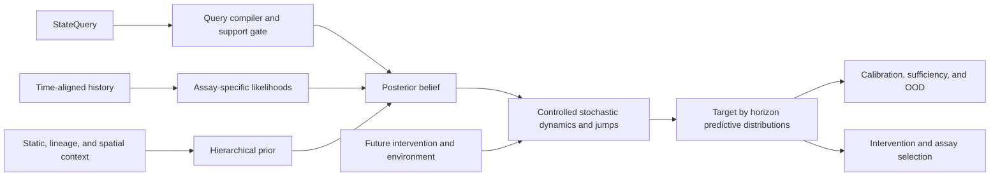

# cellstate

`cellstate` is a research framework for estimating a **query-conditioned probability
distribution over hidden, causally relevant cellular state** and using that belief to forecast
cellular behavior under declared interventions and environments.

The end-goal is not another cell atlas, embedding, or cell-type classifier. It is a scientifically
auditable foundation for virtual-cell modeling that can answer questions of the form:

> Given everything observed about this cell, clone, population, or tissue niche up to time `t`,
> what state must we believe it is in to predict its future molecular and functional behavior under
> the interventions, environments, and horizons named by the query?

The framework separates three operations:

```python
belief = estimate_cell_state(request, estimator=model)
forecast = evolve_cell_state(belief, scenario=scenario, evolution_model=model)
plan = choose_intervention(
    belief,
    objective=objective,
    candidates=candidates,
    planner=planner,
)
```

> **Project status -- pre-alpha contract kernel:** the repository currently contains strict public
> contracts, scientific diagnostics, and an intentionally narrow linear-Gaussian reference backend
> for software integration tests. It does **not** yet contain a biologically or clinically validated
> cell model. The current development focus is the public-real-data governance and frozen benchmark
> layer required before building the first biological backend.

## Scientific thesis

For a query `Q`, the target belief is:

```text
B_t^Q = P(X_t^Q, \Theta, R_{\le t}, \Xi \mid H_{\le t}, C, Q)
```

where:

- `X` is dynamic, query-relevant cellular state;
- `Theta` contains relatively stable identity, genotype, and cell-specific parameters;
- `R` is realized perturbation or target engagement, distinct from intended assignment;
- `Xi` contains assay and technical nuisance variables;
- `H` is the causally ordered observation, intervention, environment, and lineage history; and
- `C` is static, population, spatial, and experimental context.

The belief is useful only insofar as it predicts declared future targets:

```text
P(Z_{t+h} \mid B_t^Q, \operatorname{do}(U_{t:t+h}), E_{t:t+h}, Q)
```

There is no universal state representation. The state required to predict survival after a
ten-minute signaling perturbation is not necessarily the state required to predict differentiation
over two weeks. State dimensionality and factor content are therefore compiled from the system
boundary, targets, intervention and environment spaces, horizons, and precision requirements in
the query.

A candidate state is approximately sufficient only when an equally capable future predictor given
the belief plus raw history cannot materially outperform one given the belief alone. Cluster
coherence, current-observation reconstruction, and attractive visualizations are not substitutes
for that test.

## Non-negotiable principles

1. **Beliefs, not points.** Return distributions, uncertainty, identifiability, OOD status, and
   provenance--never only a deterministic latent vector.
2. **Function and intervention first.** Optimize future molecular and functional prediction under
   relevant interventions, not reconstruction of the present assay.
3. **Time and causality are explicit.** Observations, environments, interventions, washouts,
   divisions, and contact events are ordered evidence, not an unordered feature bag.
4. **Intention is not realization.** Assignment, exposure, delivery efficiency, and measured target
   engagement remain distinct.
5. **Missing is not zero.** Unknown history, unmeasured modalities, censored measurements, and
   confirmed absence have different semantics.
6. **Timescales and events remain structured.** Continuous dynamics coexist with division, death,
   differentiation, senescence, and other jumps.
7. **Context is part of the problem.** Donor, genotype, environment, neighborhood, lineage, assay,
   and batch are modeled rather than blindly regressed away.
8. **Support is earned.** A backend may claim only the species, systems, interventions, doses,
   environments, horizons, and outputs covered by its versioned support and validation evidence.
9. **Planning follows calibration.** Intervention and assay selection operate on query-target
   predictive distributions, never private latent coordinates or unsupported actions.
10. **Public-real evidence anchors biology.** Synthetic models may test software; biological
    training, calibration, and validation claims must trace to real public experiments.

## Why the system is a family of backends

Most public single-cell assays destroy the measured cell. A time course of different cells supports
population-distribution dynamics; it is not an observed individual trajectory. Clone barcodes
support lineage or fate claims, and longitudinal imaging or Live-seq-like designs support stronger
individual-cell claims.

`cellstate` will therefore distinguish individual-cell, clone, population, and spatial-niche
beliefs and build several evidence-qualified verticals:

- a **population perturbation backend** for randomized drug, genetic, cytokine, dose, and time
  screens;
- a **longitudinal-cell backend** for repeated nondestructive measurements and later outcomes;
- a **lineage/fate backend** for clone-linked early state, inheritance, and future fate;
- a **multimodal observation backend** for genuinely paired RNA, chromatin, protein, imaging, and
  physiology; and
- a **spatial/neighborhood backend** where contacts, coordinates, and non-cell-autonomous effects
  were actually measured.

These backends share contracts and evaluation infrastructure. They do not claim a shared universal
latent biology until predictive equivalence is demonstrated.

## System architecture



The planned production model is a hierarchical hybrid controlled state-space model with:

- assay-appropriate likelihoods for RNA, chromatin, protein, signaling, images, metabolism, and
  function;
- stable parameters plus fast, intermediate, and slow dynamic factors;
- shared and modality-private state;
- stochastic continuous evolution plus event and inheritance kernels;
- offline smoothing for learning and past-only filtering for deployment;
- particle or mixture posteriors around branches and rare transitions;
- soft mechanistic constraints for regulation, signaling, stoichiometry, transport, and geometry;
- explicit measurement, biological, parameter, model, and transport uncertainty; and
- calibrated target decoders with abstention outside empirical support.

Framework boundaries remain backend-neutral. PyTorch, JAX, probabilistic programming libraries,
AnnData, Zarr, OME-Zarr, experiment trackers, and storage systems enter through adapters rather than
leaking into serialized public contracts.

## Public-real-data program

No single public dataset contains, at useful scale, a complete perturbation and environment history,
multimodal state, same-cell temporal linkage, lineage, spatial context, and later functional
outcomes. The build therefore uses an **evidence mosaic**. Current sources are candidates until a
reviewed manifest admits them for an exact claim:

- Tahoe-100M, sci-Plex, MIX-Seq, Replogle Perturb-seq, and GWCD4i for intervention-response
  distributions;
- DREAM and phosphosignaling studies for short-timescale dynamics;
- paired perturbation multiome and Perturb-CITE-seq for observation-model bridges;
- Live-seq and tracked imaging for individual state-to-future tests;
- LARRY, CellTagging, and lineage-linked Perturb-seq for clone and fate models;
- Perturb-FISH, Perturb-DBiT, Perturb-map, and spatial atlases for neighborhood models;
- JUMP Cell Painting and MitoCheck for morphology and physical dynamics; and
- condition-level viability, killing, cytokine, metabolic, and clinical outcomes for functional
  decoders at their actual aggregation level.

Every admitted source receives content-addressed source-artifact records covering its accession,
version, checksums, retrieval, license and use restrictions, experimental units,
controls, assays, intervention timing, replicates, outcomes, linkage structure, and known
confounding. Separate normalization and split manifests make transformations and benchmark
membership reproducible. Public availability is not treated as unrestricted permission for
commercial model training.

Raw data remain immutable. Normalized data preserve original identifiers, counts, missingness, and
source-row provenance. Query-specific examples are generated into frozen train, calibration, and
test views. Studies are joined only through observed overlap or declared transport assumptions--not
through fictitious same-cell pairs.

## Validation standard

Cells from a shared well, donor, animal, clone, plate, or experimental arm are often pseudoreplicates.
Random cell-level splits are prohibited for scientific claims. Frozen benchmarks include:

- held-out wells, plates, donors, animals, clones, cell lines, and complete studies;
- future-time and held-out-dose prediction;
- unseen perturbations, mechanisms, chemical scaffolds, and combinations;
- missing-modality and assay-shift robustness;
- deliberate OOD systems and corrupted or incomplete histories; and
- external-accession replication with no test-time refitting.

Primary evaluation uses proper predictive scores, intervention-effect error, population distances,
hazard and fate scores, calibration coverage, risk-coverage curves, predictive sufficiency, and
planner regret. Every backend must beat persistence, matched-control, perturbed-mean, linear,
low-rank, and experimental-reproducibility baselines appropriate to its query.

Passing software tests is not biological validation. Graduation is versioned and query-specific:

1. contract and provenance correctness;
2. deterministic data ingestion and leakage-safe splits;
3. calibrated assay likelihoods;
4. future and intervention prediction beyond simple baselines;
5. calibrated uncertainty and effective OOD abstention;
6. state-versus-state-plus-history sufficiency;
7. untouched external-study replication; and
8. only then, pseudo-prospective intervention or assay planning.

## Development roadmap

The contract kernel is complete enough to support the next milestone: freeze Vertical A's query
family and subject semantics, finish the experimental dataset/benchmark manifest graph, and admit
the first checksum- and license-reviewed public datasets before writing a biological model.

The [project roadmap](docs/roadmap.md) is the sole authority for implementation order and graduation
status. The [full buildout architecture](docs/architecture/full-buildout.md) defines the target
system; the [scientific validation contract](docs/validation/scientific-validation.md) and [accepted
evidence decision](docs/adr/0004-query-scoped-public-real-evidence.md) define what may count as
evidence.

## What the repository contains today

- Strict, frozen-top-level, JSON-schema-versioned contracts for queries, histories, observations,
  context, lineage, beliefs, forecasts, and plans.
- A canonical event history with timing, provenance, missingness, intended interventions, and
  measured or inferred realization.
- Separate estimation, controlled-evolution, and planning ports.
- Structured intrinsic and context factors with explicit observability and identifiability.
- Joint posterior distributions and target-by-horizon forecast distributions.
- A Kalman-style reference backend with recursive filtering, controlled evolution, sampling, and
  fail-closed capability checks.
- Backend-independent calibration, sufficiency, and composable training primitives.
- An **experimental** public-real dataset-manifest scaffold for source hashes, use restrictions,
  experimental units, sampling linkage, modality alignment, and scoped capability assessment.
- Generated JSON Schemas, documentation, strict typing, linting, and CI across supported Python
  versions.

The reference backend deliberately rejects biology it does not implement. Its outputs are examples
of contract behavior, not estimates of real cellular state. No dataset manifest has yet been
admitted, no real-data golden slice or frozen biological benchmark is checked in, and no biological
backend is registered.

## Quick start

Python 3.11 or newer and [`uv`](https://docs.astral.sh/uv/) are recommended:

```bash
uv sync --all-extras --no-editable
uv run --no-editable python examples/estimate_state.py
uv run --no-editable pytest
```

The public API requires an explicit model; there is no scientifically meaningless default:

```python
from cellstate import estimate_cell_state
from cellstate.reference import LinearGaussianReference, minimal_reference_config

model = LinearGaussianReference(minimal_reference_config())
belief = estimate_cell_state(request, estimator=model)
```

Propagate the full belief rather than only its mean:

```python
from cellstate import evolve_cell_state

forecast = evolve_cell_state(
    belief,
    scenario=scenario,
    evolution_model=model,
)

for prediction in forecast.target_predictions:
    print(prediction.target.term.label, prediction.distribution)
```

See [`examples/estimate_state.py`](examples/estimate_state.py) for an executable synthetic contract
example. Read the [belief-state concept](docs/concepts/belief-state.md), [data
contracts](docs/architecture/data-contracts.md), and [backend guide](docs/guides/add-a-backend.md)
before implementing biology.

## Scientific non-goals

- No claim that transcriptomic embeddings or cell labels are cellular state.
- No universal/minimal state claim outside an exact query.
- No missing-as-zero imputation or automatic batch "removal."
- No causal claim from perturbation labels alone.
- No individual trajectory claim from destructive snapshot cells.
- No validation based on random held-out cells, reconstruction, clusters, or UMAP appearance.
- No silent extrapolation beyond the model's intervention, environment, context, or assay support.
- No intervention planning before target prediction, uncertainty, OOD, and calibration have passed
  their gates.

## Contributing

Run `make check` before submitting changes. Serialized contract changes require a schema-version
decision, regenerated JSON Schemas, and round-trip tests. New biological backends must include
dataset and split manifests, a support envelope, uncertainty semantics, OOD behavior, baselines, and
query-specific validation evidence.

See [CONTRIBUTING.md](CONTRIBUTING.md) and [SECURITY.md](SECURITY.md).

Large omics arrays, images, donor-sensitive data, and model weights stay outside Git and are
referenced through content-addressed artifacts. This repository is research infrastructure; it is
not medical software and its outputs must not be used for clinical decision-making without the
independent evidence, governance, and regulatory work such use would require.
