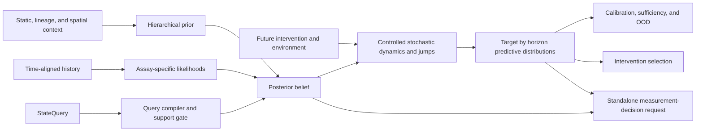

# cellstate

`cellstate` is a research framework for estimating a **query-conditioned probability
distribution over hidden, causally relevant cellular state** and using that belief to forecast
cellular behavior under declared interventions and environments.

The end-goal is not another cell atlas, embedding, or cell-type classifier. It is a scientifically
auditable foundation for virtual-cell modeling that can answer questions of the form:

> Given everything observed about this cell, clone, population, or tissue niche up to time `t`,
> what state must we believe it is in to predict its future molecular and functional behavior under
> the interventions, environments, and horizons named by the query?

The framework separates four top-level operations:

```python
belief = estimate_cell_state(request, estimator=model)
forecast = evolve_cell_state(belief, scenario=scenario, evolution_model=model)
plan = choose_intervention(
    belief,
    objective=objective,
    candidates=candidates,
    planner=planner,
)
measurement = recommend_next_measurement(
    belief,
    request=measurement_request,
    policy=measurement_policy,
)
```

The measurement operation is its own decision problem, not a field inferred opportunistically while
estimating the belief. It binds an intervention objective, an ordered candidate set, candidate
assays, collection timing, a decision deadline, utility units, and assay, delay, and collection
penalties. A numeric expected value of sample information (EVSI) is supportable only when a backend
has a calibrated assay-outcome model, can perform the hypothetical posterior update, can replan the
counterfactual intervention decision after each possible outcome, and has a declared decision
utility. Posterior covariance reduction alone is not EVSI.

> **Project status -- pre-alpha contract kernel:** the repository currently contains strict public
> contracts, scientific diagnostics, and an intentionally narrow linear-Gaussian reference backend
> for software integration tests. It does **not** yet contain a biologically or clinically validated
> cell model. Schema v2 now enforces the semantic spine needed before the first benchmark or
> biological backend can be frozen, including a standalone measurement-decision contract. The
> contract reference returns `NOT_EVALUATED` for assay value because it has no calibrated EVSI
> pipeline. The contract and scoped-eligibility adversarial gates are complete. Two machine-checked
> reviewed real-data representability ledgers pass their structural checks without resolving source
> bytes or replaying selectors, and a corrected sci-Plex3 K562 24-hour
> component benchmark is frozen with exact well-level cases and plate-level splits. It remains
> deliberately non-admitted: metric implementations, leakage audit, completed baseline runs, and
> performance thresholds have not passed. The complete biological support-port map and a
> content-addressed population assay-response scaffold are now checked in. That scaffold is not a
> hidden-state estimator and rejects every prediction call. Contract version 0.1 now implements a
> trusted admission boundary around its declarations: streamed bytes, authenticated execution-
> source selection, externally loaded interfaces, typed validation results, and query-derived
> prerequisites are rebound to exact bundle scope. Persisted receipts still are not execution
> tokens; the guards require external trust roots and just-in-time reload/reverification. The
> sci-Plex3 artifact remains `SCAFFOLD` because it has no trained model or completed scientific
> gates. Its Item 11 software path is now intentionally limited to an immutable `p1-train` loader,
> six `p1`-fit probabilistic baseline algorithms, and content-addressed streaming-run scaffolding.
> The exact 2.526 GB source has now been close-reauthenticated, all 94,785 `p1` rows scanned, and six
> non-admissible fitted-state identities frozen. Protected `p2`, `p3`, and `p4` raw UMI
> count-matrix/endpoint bytes, outcomes, and lifecycle scoring authority remain hard sealed; their
> public frozen split membership and design metadata are not an access grant. No prediction
> campaign, metric, performance comparison, or scientific
> admission has run.
> Item 12 adds a separate trusted-training boundary for a first `p1`-only candidate. Its original
> rank-16 Gamma--Poisson design, with a separate `q`/capture term and 16 free factor shapes, failed
> closed before model emission. V2 removed `q`/capture, but its free pooled shape drifted toward the
> lower guard and the fit did not converge. A fixed-`r_theta=0.1` v3 counterfactual still failed the
> relative-ELBO and terminal factor-order gates. Its rank characterization was healthy; its
> independent lognormal unseen-plate model was not (`sigma_plate=5.66126548675`). The audited v4
> software design keeps fixed `r_theta=0.1`, adds row-local inner equilibration, and proposes uniform
> selection of one complete observed `p1` `rho` row. An exact-reference, p1-only, nonissuing v4 run
> passed its integrity checks and post-hoc resource acceptance checks but failed the initial,
> untraced inner equilibration at
> sweep 50, before any outer update or ELBO trace. It emitted no model or evidence. The observed
> provisional `rho` maximum, `7.999995552807402` with each factor column summing to eight, also puts
> the proposed unseen-plate context under renewed review. This is a candidate-family risk, not a
> fitted-model pathology, because no fit was accepted. A later source-code audit found that v4's dose
> objective omits the tracked full ELBO's `94785/768` equal-well multiplier, putting its dose penalty
> on the wrong relative scale. V4 is retired, remains `NO-GO`, and no lifecycle state has changed.
> **Item 12.1a** is now reproducible from the exact historical harness, tests, parent driver, and
> reports under [`audits/item12_1a`](audits/item12_1a/). The planned v4 **Item 12.1b** real-`p1`
> replay is retired before execution. **Item 12.2** has completed its source-free v5 software scope:
> the exact equal-well objective and all-well action/context M-step agree; independent derivative
> and nondecrease checks pass; sampling is exactly positive-conditioned and request-bounded;
> publication is generation-immutable and atomically pointed; executable, mounted-input, and staged-
> output byte closure is explicit; and the reproducible Linux `amd64` OCI runtime is covered by
> parent-owned hard wall-clock and memory containment. This work opened no protected source, ran no
> real-`p1` fit, and issued no candidate artifact, plan, observation, evidence, or lifecycle result.
> The component remains `SCAFFOLD`. The next proposed milestone is a separately authorized,
> version-bound, nonissuing real-`p1` v5 execution under **Item 12.3**; it is not authorized and has
> not run.

## Scientific thesis

For a query `Q`, the target belief is:

```text
B_t^Q = P(X_t^Q, \Theta, R_{\le t}, \Xi \mid H_{\le t}, C, Q)
```

where:

- `X` is dynamic, query-relevant cellular state;
- `Theta` contains relatively stable identity, genotype, and cell-specific parameters;
- `R` is realized perturbation or target engagement, distinct from intended assignment;
- `Xi` contains assay and technical nuisance variables;
- `H` is the causally ordered observation, intervention, environment, and lineage history; and
- `C` is static, population, spatial, and experimental context.

The belief is useful only insofar as it predicts declared future targets:

```text
P(Z_{t+h} \mid B_t^Q, \operatorname{do}(U_{t:t+h}), E_{t:t+h}, Q)
```

There is no universal state representation. The state required to predict survival after a
ten-minute signaling perturbation is not necessarily the state required to predict differentiation
over two weeks. State dimensionality and factor content are therefore compiled from the system
boundary, targets, intervention and environment spaces, horizons, and precision requirements in
the query.

A candidate state is approximately sufficient only when an equally capable future predictor given
the belief plus raw history cannot materially outperform one given the belief alone. Cluster
coherence, current-observation reconstruction, and attractive visualizations are not substitutes
for that test.

## Non-negotiable principles

1. **Beliefs, not points.** Return distributions, uncertainty, identifiability, OOD status, and
   provenance--never only a deterministic latent vector.
2. **Function and intervention first.** Optimize future molecular and functional prediction under
   relevant interventions, not reconstruction of the present assay.
3. **Time and causality are explicit.** Observations, environments, interventions, washouts,
   divisions, and contact events are ordered evidence, not an unordered feature bag.
4. **Intention is not realization.** Assignment, exposure, delivery efficiency, and measured target
   engagement remain distinct.
5. **Missing is not zero.** Unknown history, unmeasured modalities, censored measurements, and
   confirmed absence have different semantics.
6. **Timescales and events remain structured.** Continuous dynamics coexist with division, death,
   differentiation, senescence, and other jumps.
7. **Context is part of the problem.** Donor, genotype, environment, neighborhood, lineage, assay,
   and batch are modeled rather than blindly regressed away.
8. **Support is earned.** A backend may claim only the species, systems, interventions, doses,
   environments, horizons, and outputs covered by its versioned support and validation evidence.
9. **Planning follows calibration.** Intervention and assay selection operate on query-target
   predictive distributions, never private latent coordinates or unsupported actions.
10. **Public-real evidence anchors biology.** Synthetic models may test software; biological
    training, calibration, and validation claims must trace to real public experiments.

## Why the system is a family of backends

Most public single-cell assays destroy the measured cell. A time course of different cells supports
population-distribution dynamics; it is not an observed individual trajectory. Clone barcodes
support lineage or fate claims, and longitudinal imaging or Live-seq-like designs support stronger
individual-cell claims.

`cellstate` will therefore distinguish individual-cell, clone, population, and spatial-niche
beliefs and build several evidence-qualified verticals:

- a **population perturbation backend** for randomized drug, genetic, cytokine, dose, and time
  screens;
- a **longitudinal-cell backend** for repeated nondestructive measurements and later outcomes;
- a **lineage/fate backend** for clone-linked early state, inheritance, and future fate;
- a **multimodal observation backend** for genuinely paired RNA, chromatin, protein, imaging, and
  physiology; and
- a **spatial/neighborhood backend** where contacts, coordinates, and non-cell-autonomous effects
  were actually measured.

These backends share contracts and evaluation infrastructure. They do not claim a shared universal
latent biology until predictive equivalence is demonstrated.

## System architecture



The planned production model is a hierarchical hybrid controlled state-space model with:

- assay-appropriate likelihoods for RNA, chromatin, protein, signaling, images, metabolism, and
  function;
- stable parameters plus fast, intermediate, and slow dynamic factors;
- shared and modality-private state;
- stochastic continuous evolution plus event and inheritance kernels;
- offline smoothing for learning and past-only filtering for deployment;
- particle or mixture posteriors around branches and rare transitions;
- soft mechanistic constraints for regulation, signaling, stoichiometry, transport, and geometry;
- explicit measurement, biological, parameter, model, and transport uncertainty; and
- calibrated target decoders with abstention outside empirical support.

Framework boundaries remain backend-neutral. PyTorch, JAX, probabilistic programming libraries,
AnnData, Zarr, OME-Zarr, experiment trackers, and storage systems enter through adapters rather than
leaking into serialized public contracts.

## Public-real-data program

No single public dataset contains, at useful scale, a complete perturbation and environment history,
multimodal state, same-cell temporal linkage, lineage, spatial context, and later functional
outcomes. The build therefore uses an **evidence mosaic**. Current sources are candidates until a
reviewed manifest admits them for an exact claim:

- Tahoe-100M, sci-Plex, MIX-Seq, Replogle Perturb-seq, and GWCD4i for intervention-response
  distributions;
- DREAM and phosphosignaling studies for short-timescale dynamics;
- paired perturbation multiome and Perturb-CITE-seq for observation-model bridges;
- Live-seq and tracked imaging for individual state-to-future tests;
- LARRY, CellTagging, and lineage-linked Perturb-seq for clone and fate models;
- Perturb-FISH, Perturb-DBiT, Perturb-map, and spatial atlases for neighborhood models;
- JUMP Cell Painting and MitoCheck for morphology and physical dynamics; and
- condition-level viability, killing, cytokine, metabolic, and clinical outcomes for functional
  decoders at their actual aggregation level.

Every admitted source receives content-addressed source-artifact records covering its accession,
version, checksums, retrieval, license and use restrictions, experimental units,
controls, assays, intervention timing, replicates, outcomes, linkage structure, and known
confounding. Separate normalization and split manifests make transformations and benchmark
membership reproducible. Public availability is not treated as unrestricted permission for
commercial model training.

Raw data remain immutable. Normalized data preserve original identifiers, counts, missingness, and
source-row provenance. Query-specific examples are generated into frozen train, calibration, and
test views. Studies are joined only through observed overlap or declared transport assumptions--not
through fictitious same-cell pairs.

## Validation standard

Cells from a shared well, donor, animal, clone, plate, or experimental arm are often pseudoreplicates.
Random cell-level splits are prohibited for scientific claims. Frozen benchmarks include:

- held-out wells, plates, donors, animals, clones, cell lines, and complete studies;
- future-time and held-out-dose prediction;
- unseen perturbations, mechanisms, chemical scaffolds, and combinations;
- missing-modality and assay-shift robustness;
- deliberate OOD systems and corrupted or incomplete histories; and
- external-accession replication with no test-time refitting.

Primary evaluation uses proper predictive scores, intervention-effect error, population distances,
hazard and fate scores, calibration coverage, risk-coverage curves, predictive sufficiency, and
planner regret. Every backend must beat persistence, matched-control, perturbed-mean, linear,
low-rank, and experimental-reproducibility baselines appropriate to its query.

Passing software tests is not biological validation. Graduation is versioned and query-specific:

1. contract and provenance correctness;
2. deterministic data ingestion and leakage-safe splits;
3. calibrated assay likelihoods;
4. future and intervention prediction beyond simple baselines;
5. calibrated uncertainty and effective OOD abstention;
6. state-versus-state-plus-history sufficiency;
7. untouched external-study replication; and
8. only then, pseudo-prospective intervention or assay planning.

## Development roadmap

The contract kernel is undergoing a deliberate semantic-alignment pass before a biological backend
is permitted to make validated claims.
Belief-subject and destructive-evidence semantics, bounded query support, query compilation,
perturbation realization, scientific readiness and abstention, causal status, decision-oriented
measurement selection, and scoped real-data eligibility are implemented. Reviewed Replogle K562
and GSE141064 Live-seq proofs now demonstrate that destructive population evidence and
viability-preserving same-cell future-function evidence remain representable as different
estimands. The corrected sci-Plex3 K562 24-hour component benchmark now freezes the first exact
population query, physical splits, authoritative cases, metric semantics, mandatory baselines, and
acceptance policy without pretending those planned implementations have run. The biological-bundle
contract now exhaustively classifies the original model stages and keeps the first direct population
assay-response scaffold outside all four public cell-state operations. Its v0.1 trusted admission
boundary incrementally hashes every consumed byte, authenticates workflow-derived data sources,
checks objects loaded outside the receipt issuer against an application-owned interface registry,
verifies typed result semantics separately from result pass/fail, and recompiles query-dependent
prerequisites. Execution guards then reload and reverify the exact object immediately before use.
This infrastructure does not graduate the component: sci-Plex3 remains a non-executable
`SCAFFOLD`. Item 11 adds a single-purpose immutable `p1-train` loader and six `p1`-only
probabilistic baselines while keeping protected `p2`, `p3`, and `p4` raw UMI
count-matrix/endpoint bytes, outcomes, and lifecycle scoring authority hard sealed behind future
grants. Frozen split membership and benchmark-design metadata are public and supply outcome-free
prediction schedules, but grant no endpoint or scoring access. Each
baseline supports the no-action condition; the alternate-dose baseline excludes the
requested dose. Frozen execution uses 512 samples per case and seed for seeds 0 through 4 with
NumPy `PCG64DXSM`. The exact 2,526,631,614-byte source has been close-reauthenticated, all 94,785
`p1` rows have been scanned, and content-addressed fitted-state identities for all six baselines
have been recorded. Seven rows with zero counts on the selected panel are retained, not silently
excluded. No prediction campaign, metric, baseline comparison, or performance gate has run, so
benchmark performance and admission remain false.

Item 12 now defines the distinct boundary for a first nonvacuous population-response candidate. An
immutable pre-fit plan binds the exact `p1` role and count stream, candidate semantics, trainer and
factory code, output schema, and a single-thread Linux `x86_64` reference runtime: CPython 3.11.15,
NumPy 2.4.6, SciPy 1.17.1, and `scipy-openblas` 0.3.31.188.0. Runtime-only HMAC attestations for
source selection and fit semantics remain external trust inputs rather than serialized execution
tokens. V1 failed closed when its separate `q`/capture term and 16 free factor shapes reallocated
variance to a rejected shape boundary. V2 removed `q`/capture, but its free pooled shape fell to
approximately `0.073524` and its outer trajectory was still drifting at pass 50. V3 fixed the shape
at `0.1`; it still failed the predeclared relative-ELBO and terminal factor-order gates. A bounded
characterization showed that v3's activation rank was about 56.85 times above its strict gate, so
the apparent rank issue was a 12-decimal portability ambiguity, not scientific low rank. The same
run rejected the independent mean-one lognormal plate nuisance as tail-dominated at
`sigma_plate=5.66126548675`.

The audited incompatible v4 software design retains 16 continuous Gamma--Poisson factors, fixes
`r_theta=0.1`, equilibrates row-local posterior coordinates inside every canonical batch, and
proposes unseen-plate context by uniformly selecting one complete observed `p1` `rho` row rather
than drawing factorwise lognormal scales. Its future p2 declaration precommits to
`tau_j=exp(j/20)` for integer `j=-20,...,6`, with shape `0.1/tau_j^2` and factorwise-renormalized
`rho^tau_j`; no p2 data have been opened and no `tau` has been selected.

The first v4 launch was infrastructure-invalid: its audit hook rejected h5py's nonpersistent
`/dev/null` probe before fitting. Report
`4677fc8ef1a458bf3616abc507250572c2da7a8d53c1c8a7a03d4b097f3d4877` is diagnostic only and is
not scientific evidence. The replacement exact-reference, p1-only, nonissuing run is recorded by
report `66e9debc1a402e7aa68cbc934f7c5f641529eea3187ec15606364c912af8faa8`. It passed its integrity
and post-hoc resource acceptance checks and kept every provisional tensor finite, then failed
initial, untraced inner
equilibration at sweep 50 with convergence streak 0, `Rshape=0.24714465227035654`, and
`Relog=3.750385840630546`, before any outer update or ELBO trace. Those residuals are respectively
24,714,465 and 375,038,584 times the `1e-8` tolerance. The provisional loading-rank ratio
`0.101239623839`, activation-rank ratio `0.001249342162`, and minimum contribution share
`0.001237124212` describe initialization only and do not rescue that failure. The provisional
`rho` maximum was `7.999995552807402`; because each factor column sums to eight, at least one factor
places `99.9999444101%` of its eight-context mass on one plate, for an effective context count of
approximately `1.0000011118`. This is a candidate-family risk, not a fitted-model pathology, and
the empirical whole-row unseen-plate proposal must be reexamined.

No v4 model, plan, observation, training evidence, materialization, or lifecycle result was issued.
V4 is `NO-GO`, `TRAINED_CANDIDATE` cannot be derived, and protected `p2`, `p3`, and `p4` raw endpoint
and scoring access remains sealed; every later scientific and runtime gate remains false. **Item
12.1a** is complete and reproducible from
the exact historical harness (`f4e6b768...`), tests (`8989618e...`), parent driver (`795c5929...`),
and reports under [`audits/item12_1a`](audits/item12_1a/). Its 26 focused tests and independent audit
covered the bounded local-map and containment contract: 50 production maps, one `A51` lookahead,
synchronized local objectives, one- and two-step diagnostics, analytic Jacobians, replay equality,
and all 16 bounded `rho` context summaries.

A subsequent source-code audit found an outer-objective defect outside that audit's scope. V4's dose
Newton block minimizes an unweighted per-well Gamma term plus the global dose penalty, whereas the
tracked full equal-well ELBO multiplies the corresponding Gamma term by `94785/768`. V4 is therefore
retired, and the planned **Item 12.1b** real-`p1` replay is retired before execution. **Item 12.2**
then completed the replacement source-free v5 design. Its canonical fixed-`q` action/context
objective applies the exact `94785/768` equal-well scale to all 768 wells, and its all-well M-step
jointly covers `alpha`, arithmetic-mean-one constrained `log-rho`, and the `delta` dose-effect
tensor. A separately implemented scalar objective, finite-difference gradients and Hessians,
treated-well adversarial
fixtures, and accepted-substep and complete-block checks establish nondecrease on that same
objective.

The v5 sampler conditions the whole panel exactly through a zero-truncated superposed compound-
Poisson/log-series construction. Exact `CandidateSampleRequest` support caps a request at 512 draws
and certifies a conservative conditional signed-`int64` tail bound of at most `2^-64` across all 753
actions (752 compound-dose actions plus no action), one neutral unit unseen-plate context, and all 27
declared calibration `tau` values. Target-only support is rejected. Publication stages and verifies
one immutable generation before atomically replacing `current.json`, with reader old-or-new
visibility and forced-termination recovery. The pre-fit contract now binds a complete Python code
closure and exact mounted public-control inputs; worker and parent observations re-inventory and seal
the typed staged output closure.

Two independent no-cache Linux `amd64` OCI builds produced byte-identical index
`sha256:ababac344fae7f3d679cf9b3bbf4c46b8f3b169b358566d4abd6e3b0e7b8251e`; its runnable child
manifest is `sha256:edd451f171161472c1a3bb6a1ae434cdedc5b776e228757ac732522c1035df18`
and config is `sha256:b9cdf1e179f149319b038f2f58bb80470c2a1b5bda8f1cf9d2ccbe17fe3b59e5`;
the Dockerfile SHA-256 is
`ec21cc81a3b4d71f5de745adde74506d63da0d9b317996c8f97b067e90347e7a`.
Native-Linux execution freezes `host-effective-uid-gid`: the worker uses the host's numeric
effective UID/GID, the mode-`0700` tmpfs uses that same UID/GID, and the anonymous snapshot volume
initializes from an empty mode-`1777` image directory. This lets the contained non-root worker use
the declared `0400`/`0700` host binds without weakening their permissions.
The parent accounts its 3,600-second budget before public staging and actively bounds Docker
commands and waits; any returned staging overrun fails before container creation. An independent
3,540-second in-container watchdog begins before protected-source open and covers snapshot, fit,
and close-reauthentication. Docker's memory and total-memory-plus-swap limits are both 4 GiB,
disabling additional swap. Tests prove timeout, OOM, descendant/container and anonymous-volume
cleanup, no canonical publication, and next-run recovery behavior; the successful live path also
proves parent no-follow re-inventory and sealing of the exact worker stage. These are source-free
software results. No protected source was opened, no real-`p1` fit ran, and no candidate artifact,
plan, observation, evidence, materialization, or lifecycle result was issued. The component remains
`SCAFFOLD`. A separately authorized, version-bound, nonissuing real-`p1` v5 execution is merely
proposed as **Item 12.3**; it is neither authorized nor run and grants no held-out access or
biological/performance claim.

The [project roadmap](docs/roadmap.md) is the sole authority for implementation order and graduation
status. The [full buildout architecture](docs/architecture/full-buildout.md) defines the target
system; the [scientific validation contract](docs/validation/scientific-validation.md) and [accepted
evidence decision](docs/adr/0004-query-scoped-public-real-evidence.md) define what may count as
evidence.

## What the repository contains today

- Strict, deeply immutable, JSON-schema-versioned contracts for queries, histories, observations,
  context, lineage, beliefs, forecasts, intervention plans, and measurement decisions.
- Typed individual-cell, clone/lineage, population, and spatial-niche subjects with explicit
  evidence linkage, sampling unit, collection effect, and target aggregation.
- A query compiler whose fingerprinted active/excluded factor specification travels with every
  belief and forecast.
- Request- and scenario-scoped capability preflights, scientific-readiness thresholds, causal and
  transport labels, and typed abstention rather than plausible-looking unsupported answers.
- A canonical event history with timing, provenance, missingness, intended interventions, and
  measured or inferred realization.
- Separate estimation, controlled-evolution, intervention-planning, and measurement-policy ports.
- Structured intrinsic and context factors with explicit observability and identifiability.
- Joint posterior distributions and target-by-horizon forecast distributions.
- A Kalman-style reference backend with recursive filtering, controlled evolution, sampling, and
  fail-closed capability checks.
- A standalone measurement-decision boundary whose contract reference returns `NOT_EVALUATED`
  instead of reporting covariance shrinkage as decision value.
- Backend-independent calibration, sufficiency, and composable training primitives.
- An **experimental** `0.3-experimental` public-real dataset ledger with source hashes, layered use
  restrictions, experimental units, sampling linkage, modality alignment, repeated canonical claim
  assessments, exact functional readouts, independently gated loss/metric eligibility,
  content-addressed slices, and interval-aware evidence clocks.
- Machine-checked reviewed representability ledgers for a Replogle K562 destructive population
  snapshot and a GSE141064 Live-seq individual functional recorder. They validate bound reviewed
  attestations rather than resolving source bytes or replaying selectors, establish contract
  representability only, keep `use_authorized=false`, and admit no biological benchmark.
- A frozen, content-addressed sci-Plex3 K562 24-hour component benchmark with exact source-byte
  identity, output schema, well-level cases, physical plate splits, planned metrics/baselines, and a
  fail-closed acceptance policy. Its performance gates are unrun and it is not scientifically
  admitted.
- A narrow sci-Plex3 K562 Item 11 software path: immutable CSR batches from `p1-train` only; six
  probabilistic raw-count baselines fit only from `p1`, including no-action behavior and a nearest
  alternate-dose comparator; deterministic `PCG64DXSM` sampling; and streamed, content-addressed
  fitted-state and prediction-run scaffolding. The exact source scan and six software-only fits are
  recorded; no baseline prediction, metric, comparison, or performance result is asserted.
- An Item 12 p1-only candidate-training boundary with an immutable pre-fit plan, deterministic
  training evidence, runtime-only authenticated source/fit attestations, exact model reload and
  behavior checks, and a registry-owned candidate-factory interface. V1, v2, and the v3
  counterfactual all failed closed without emitting a model. The exact-reference, p1-only,
  nonissuing v4 run also failed closed during initial inner equilibration, before any outer update
  or ELBO trace. Its empirical whole-row plate proposal requires reexamination, and its dose
  objective is now known to be inconsistently scaled relative to the full ELBO. V4 is retired; no
  v4 artifact exists and `TRAINED_CANDIDATE` cannot be derived. Its exact historical audit lineage
  is preserved under [`audits/item12_1a`](audits/item12_1a/).
- A completed source-free Item 12.2 v5 software boundary: exact equal-well objective/M-step
  agreement; independent derivative and nondecrease checks; exact-positive request-level sampling
  through 512 draws with a global `2^-64` conditional signed-`int64` tail budget; immutable atomic
  generation publication; exact code/input/stage closure; reproducible Linux `amd64` OCI identity;
  and parent-owned whole-container containment. It is software scaffolding only: no real `p1` fit
  or issued candidate/lifecycle artifact exists, and Item 12.3 remains an unauthorized proposal.
- An experimental biological-bundle and support-envelope contract with an exhaustive stage-port
  map, operation-specific prerequisites, content-addressed training/calibration/validation
  bindings, and a derived component lifecycle. The first sci-Plex3 population assay-response
  scaffold binds the exact benchmark but contains no weights, exposes no public cell-state
  operation, and cannot emit a prediction or belief.
- An experimental trusted-admission boundary with streaming exact-byte receipts, authenticated
  workflow-derived execution sources, isolated loaded-interface observations, capability-scoped
  external HMAC trust roots, closed-world typed validation-result receipts, deterministic query-
  derived prerequisites, and nonserialized just-in-time runtime handles.
- Generated JSON Schemas, documentation, strict typing, linting, and CI across supported Python
  versions.

The reference backend deliberately rejects biology it does not implement. Its outputs are examples
of contract behavior, not estimates of real cellular state. Reviewed representability artifacts
and one frozen component benchmark are checked in, but no benchmark has passed biological
performance admission and no biological backend is registered. The checked-in population-response
scaffold is an admission boundary and implementation target, not a working biological model.

## Quick start

Python 3.11 or newer and [`uv`](https://docs.astral.sh/uv/) are recommended:

```bash
uv sync --all-extras --no-editable
uv run --no-editable python examples/estimate_state.py
uv run --no-editable pytest
```

The public API requires an explicit model; there is no scientifically meaningless default. Valid
beliefs and forecasts return even when their scientific-readiness report requires abstention, so
callers can inspect the structured reasons without an override:

```python
from cellstate import InferenceOptions, estimate_cell_state
from cellstate.reference import LinearGaussianReference, minimal_reference_config

model = LinearGaussianReference(minimal_reference_config())
options = InferenceOptions(seed=0)
belief = estimate_cell_state(request, estimator=model, options=options)
if belief.readiness.abstention_required:
    print(belief.readiness.reasons)
```

Propagate the full belief rather than only its mean:

```python
from cellstate import evolve_cell_state

forecast = evolve_cell_state(
    belief,
    scenario=scenario,
    evolution_model=model,
    options=options,
)

for prediction in forecast.target_predictions:
    print(prediction.target.term.label, prediction.distribution)
```

See [`examples/estimate_state.py`](examples/estimate_state.py) for an executable synthetic contract
example. Read the [belief-state concept](docs/concepts/belief-state.md), [data
contracts](docs/architecture/data-contracts.md), and [backend guide](docs/guides/add-a-backend.md)
before implementing biology.

## Scientific non-goals

- No claim that transcriptomic embeddings or cell labels are cellular state.
- No universal/minimal state claim outside an exact query.
- No missing-as-zero imputation or automatic batch "removal."
- No causal claim from perturbation labels alone.
- No individual trajectory claim from destructive snapshot cells.
- No validation based on random held-out cells, reconstruction, clusters, or UMAP appearance.
- No silent extrapolation beyond the model's intervention, environment, context, or assay support.
- No intervention planning before target prediction, uncertainty, OOD, and calibration have passed
  their gates.
- No assay recommendation from posterior covariance reduction alone; supported EVSI requires a
  calibrated assay-outcome model, hypothetical update, counterfactual replanning, and decision
  utility.

## Contributing

Run `make check` before submitting changes. Serialized contract changes require a schema-version
decision, regenerated JSON Schemas, and round-trip tests. New biological backends must include
dataset and split manifests, a support envelope, uncertainty semantics, OOD behavior, baselines, and
query-specific validation evidence.

See [CONTRIBUTING.md](CONTRIBUTING.md) and [SECURITY.md](SECURITY.md).

Large omics arrays, images, donor-sensitive data, and model weights stay outside Git and are
referenced through content-addressed artifacts. This repository is research infrastructure; it is
not medical software and its outputs must not be used for clinical decision-making without the
independent evidence, governance, and regulatory work such use would require.
